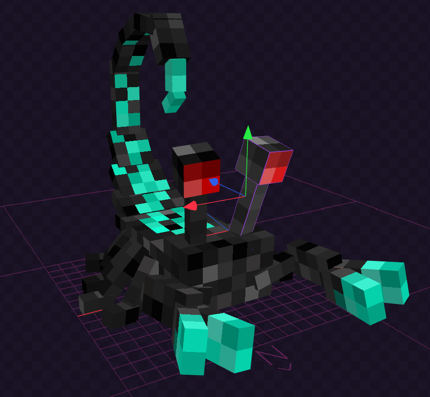

# Soul scorpion

## Basic attributes

- Health: 5 hearts
- Speed: 0.25
- Attack damage: a heart for players, 2 hearts for animals
- Special ability: sting the target with poison that applies weakness for players and slowness for animals with a cooldown of 10 seconds

## Picture

